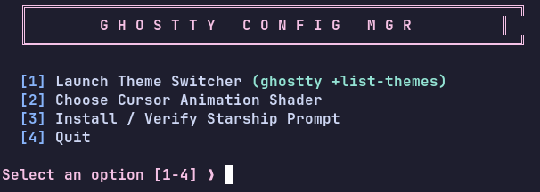
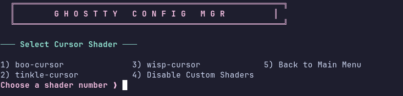
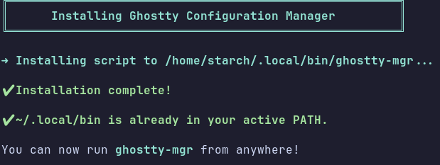

# Ghostty Configuration Manager (`ghostty-mgr`)

A lightweight, stylized TUI management suite for **Ghostty** terminal emulator. Easily switch themes, toggle custom GLSL cursor shaders, install Starship prompt, and manage your Ghostty configuration automatically.

---

## Previews

| Main Menu | Shader Selector | Starship Setup |
| :---: | :---: | :---: |
|  |  |  |

---

## Features

- 🎨 **Theme Switcher:** Quick access to Ghostty's native theme browser (`ghostty +list-themes`).
- ✨ **Cursor Shader Selector:** Dynamically select, apply, or disable GLSL cursor shaders without manual config editing.
- 🚀 **Starship Prompt Assistant:** Automatically detects your Linux distribution and provides/runs the exact package manager command to install Starship.
- ⚙️ **Automated Environment Setup:** Includes an `install.sh` script that places the manager in `~/.local/bin` and auto-configures your shell environment (`.bashrc`, `.zshrc`, `config.fish`, etc.).

---

## Installation

Clone the repository and run the installer script:

```bash
git clone [https://github.com/StarchDEV/ghostty-mgr.git](https://github.com/StarchDEV/ghostty-mgr.git)
cd ghostty-mgr
chmod +x install.sh
./install.sh
